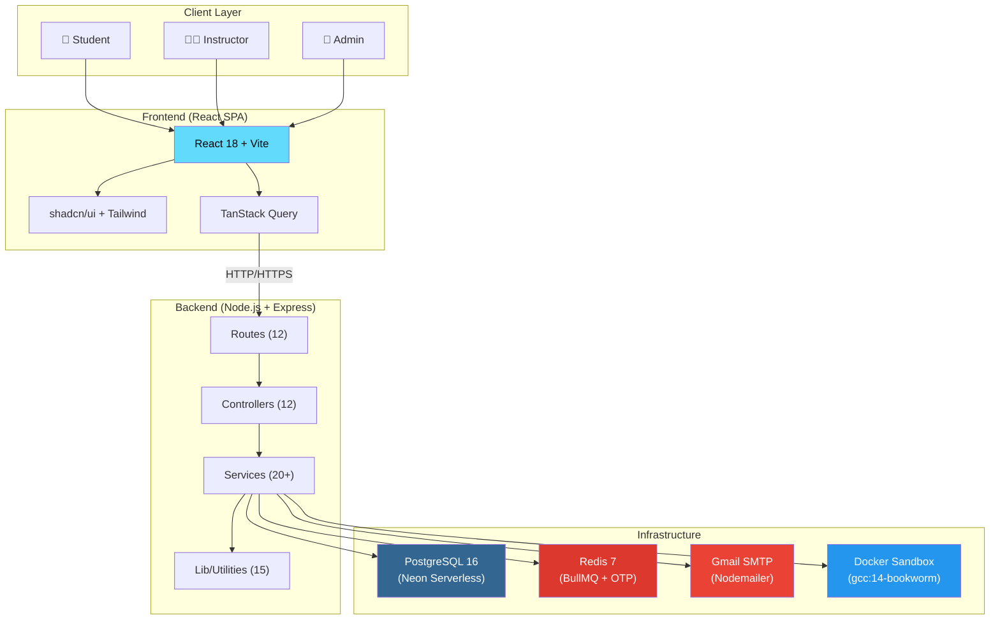
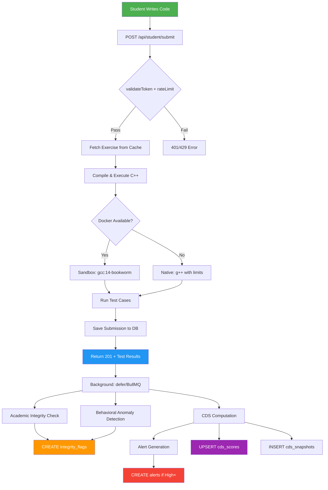
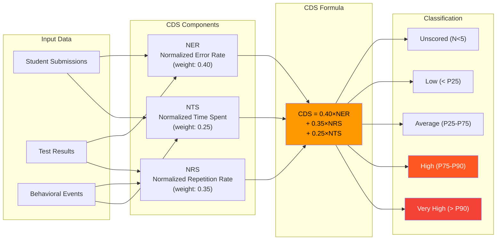
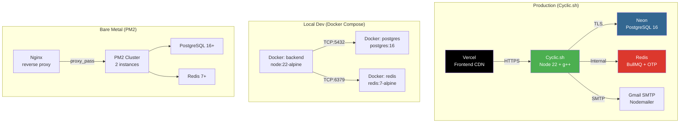
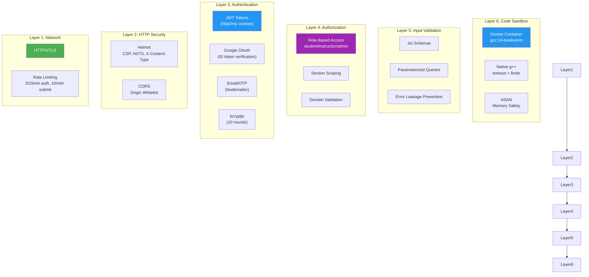

# CodeInsight — System Architecture Diagram

> **Version**: 2.0 | **Last Updated**: August 2026

---

## 1. High-Level System Architecture

```
┌─────────────────────────────────────────────────────────────────────────────────────────┐
│                              CLIENTS / BROWSERS                                        │
│                                                                                         │
│  ┌─────────────┐  ┌─────────────┐  ┌─────────────┐  ┌─────────────┐                   │
│  │   Student    │  │ Instructor  │  │    Admin     │  │   TA /      │                   │
│  │  Dashboard   │  │  Dashboard  │  │  Dashboard   │  │ Co-Instr.   │                   │
│  └──────┬──────┘  └──────┬──────┘  └──────┬──────┘  └──────┬──────┘                   │
│         │                │                │                │                            │
│         └────────────────┴────────────────┴────────────────┘                           │
│                                    │ HTTPS / HTTP                                      │
└────────────────────────────────────┼────────────────────────────────────────────────────┘
                                     │
┌────────────────────────────────────▼────────────────────────────────────────────────────┐
│                           FRONTEND (React SPA)                                         │
│                                                                                         │
│  ┌──────────────────────────────────────────────────────────────────────────────────┐   │
│  │  React 18 + Vite  │  Tailwind v4  │  shadcn/ui (Radix)  │  TanStack Query       │   │
│  │  React Router v6  │  Recharts/D3   │  Framer Motion      │  Zod Validation       │   │
│  └──────────────────────────────────────────────────────────────────────────────────┘   │
│                                                                                         │
│  ┌──────────┐ ┌──────────┐ ┌──────────┐ ┌──────────┐ ┌──────────┐ ┌──────────┐       │
│  │  Auth     │ │ Student  │ │Instructor│ │  Admin   │ │ Analytics│ │  Search  │       │
│  │  Pages    │ │  Pages   │ │  Pages   │ │  Pages   │ │  Pages   │ │  Pages   │       │
│  └──────────┘ └──────────┘ └──────────┘ └──────────┘ └──────────┘ └──────────┘       │
│                                                                                         │
│  └───────────────────────────────┬──────────────────────────────────────────────────┘   │
│                                  │  Axios HTTP Client                                  │
└──────────────────────────────────┼──────────────────────────────────────────────────────┘
                                   │
                                   ▼
┌──────────────────────────────────────────────────────────────────────────────────────────┐
│                            API GATEWAY / PROXY                                          │
│                    ┌─────────────────────────────────────┐                              │
│                    │         Cyclic.sh / Nginx           │                              │
│                    │      HTTPS Termination              │                              │
│                    │      Rate Limiting                  │                              │
│                    │      CORS Headers                   │                              │
│                    └─────────────────┬───────────────────┘                              │
└──────────────────────────────────────┼──────────────────────────────────────────────────┘
                                       │
┌──────────────────────────────────────▼──────────────────────────────────────────────────┐
│                        BACKEND (Node.js + Express.js)                                  │
│                                                                                         │
│  ┌────────────────────────────────────────────────────────────────────────────────────┐  │
│  │                         MIDDLEWARE LAYER                                          │  │
│  │  ┌──────────┐ ┌──────────┐ ┌──────────┐ ┌──────────┐ ┌──────────┐ ┌──────────┐  │  │
│  │  │ helmet   │ │   CORS   │ │ pino-http│ │ rateLimit│ │   JWT    │ │ validate │  │  │
│  │  │ security │ │ allowed  │ │ request  │ │ express- │ │  auth.js │ │  joi     │  │  │
│  │  │ headers  │ │ origins  │ │ logging  │ │ rate-lmt │ │          │ │          │  │  │
│  │  └──────────┘ └──────────┘ └──────────┘ └──────────┘ └──────────┘ └──────────┘  │  │
│  └────────────────────────────────────────────────────────────────────────────────────┘  │
│                                       │                                                  │
│  ┌────────────────────────────────────▼───────────────────────────────────────────────┐  │
│  │                           ROUTES (12 files)                                        │  │
│  │                                                                                   │  │
│  │  ┌─────────┐ ┌──────────┐ ┌───────────┐ ┌──────────┐ ┌──────────┐ ┌──────────┐  │  │
│  │  │  auth   │ │ sections │ │ exercises │ │ student  │ │submissions│ │analytics │  │  │
│  │  │         │ │          │ │           │ │          │ │           │ │          │  │  │
│  │  └────┬────┘ └────┬─────┘ └─────┬─────┘ └────┬─────┘ └─────┬─────┘ └────┬─────┘  │  │
│  │       │           │             │             │             │             │          │  │
│  │  ┌─────────┐ ┌──────────┐ ┌───────────┐ ┌──────────┐ ┌──────────┐ ┌──────────┐  │  │
│  │  │  admin  │ │ integrity│ │  search   │ │  export  │ │evaluation│ │adminCfg  │  │  │
│  │  │         │ │          │ │           │ │          │ │          │ │          │  │  │
│  │  └────┬────┘ └────┬─────┘ └─────┬─────┘ └────┬─────┘ └─────┬─────┘ └──────────┘  │  │
│  └───────┼───────────┼─────────────┼─────────────┼─────────────┼──────────────────────┘  │
│          │           │             │             │             │                          │
│          ▼           ▼             ▼             ▼             ▼                          │
│  ┌────────────────────────────────────────────────────────────────────────────────────┐  │
│  │                        CONTROLLERS (12 files)                                      │  │
│  │                                                                                   │  │
│  │  ┌──────────┐ ┌──────────┐ ┌──────────┐ ┌──────────┐ ┌──────────┐ ┌──────────┐  │  │
│  │  │  auth    │ │  admin   │ │ exercise │ │section   │ │submission│ │analytics │  │  │
│  │  │ Ctrl     │ │ Ctrl     │ │ Ctrl     │ │ Ctrl     │ │ Ctrl     │ │ Ctrl     │  │  │
│  │  └──────────┘ └──────────┘ └──────────┘ └──────────┘ └──────────┘ └──────────┘  │  │
│  │                                                                                   │  │
│  │  ┌──────────┐ ┌──────────┐ ┌──────────┐ ┌──────────┐                             │  │
│  │  │enrollment│ │integrity │ │ Uploads  │ │adminCfg  │                             │  │
│  │  │ Ctrl     │ │ Ctrl     │ │ Ctrl     │ │ Ctrl     │                             │  │
│  │  └──────────┘ └──────────┘ └──────────┘ └──────────┘                             │  │
│  └────────────────────────────────────────────────────────────────────────────────────┘  │
│                                       │                                                  │
│                                       ▼                                                  │
│  ┌────────────────────────────────────────────────────────────────────────────────────┐  │
│  │                    SERVICES (Core Business Logic)                                  │  │
│  │                                                                                   │  │
│  │  ┌─────────────────────────┐  ┌─────────────────────────┐  ┌──────────────────┐  │  │
│  │  │    EXECUTION ENGINE     │  │    CDS COMPUTATION      │  │  INTEGRITY       │  │  │
│  │  │                         │  │                         │  │                  │  │  │
│  │  │  executor.js            │  │  cdsEngine.js           │  │  academic        │  │  │
│  │  │  • C++ compilation      │  │  • NER calculation      │  │  │ IntegrityEng  │  │  │
│  │  │  • Test case execution  │  │  • NRS calculation      │  │  │ • Pattern     │  │  │
│  │  │  • Docker sandbox       │  │  • NTS calculation      │  │  │   matching    │  │  │
│  │  │  • Native fallback      │  │  • Classification       │  │  │ • Plagiarism  │  │  │
│  │  │  • ASAN enabled         │  │  • Batch processing     │  │  │   detection   │  │  │
│  │  │  • Timeout/resource     │  │  • Snapshot logging     │  │  │ • Code similarity│ │  │
│  │  │    limits               │  │  • Alert generation     │  │  │                  │  │  │
│  │  └─────────────────────────┘  └─────────────────────────┘  │  integrityFlag    │  │  │
│  │                                                            │  │ Engine.js       │  │  │
│  │  ┌─────────────────────────┐  ┌─────────────────────────┐  │ • Flag creation  │  │  │
│  │  │   AST VERIFICATION      │  │   BEHAVIORAL TRACKING   │  │ • Severity calc  │  │  │
│  │  │                         │  │                         │  │ • Status mgmt    │  │  │
│  │  │  astVerifier.js         │  │  behavioralAnomaly-     │  └──────────────────┘  │  │
│  │  │  • tree-sitter C++      │  │  Detector.js            │                        │  │
│  │  │  • Pattern matching     │  │  • Tab switch detection │  ┌──────────────────┐  │  │
│  │  │  • Node counting        │  │  • Paste detection      │  │  ANALYTICS       │  │  │
│  │  │  • Quality scoring      │  │  • Idle time tracking   │  │                  │  │  │
│  │  │                         │  │  • Behavioral anomaly   │  │  analyticsEngine │  │  │
│  │  └─────────────────────────┘  │    scoring              │  │  conceptAnalytics│  │  │
│  │                               └─────────────────────────┘  │  microConcept    │  │  │
│  │                                                            │  │  Engine.js      │  │  │
│  │  ┌─────────────────────────┐  ┌─────────────────────────┐  │  longitudinal    │  │  │
│  │  │  SUBMISSION PIPELINE    │  │   REPORTING             │  │  ReportEngine    │  │  │
│  │  │  (shared sync/async)    │  │                         │  │  codeGrowth      │  │  │
│  │  │                         │  │  pdfReport.js           │  │  RateDetector    │  │  │
│  │  │  submissionPipeline.js  │  │  exportService.js       │  └──────────────────┘  │  │
│  │  │  • graduatedFlag()      │  │  classMisconception-    │                        │  │
│  │  │  • runAcademicIntegrity │  │  Report.js              │  ┌──────────────────┐  │  │
│  │  │  • runBehavioralChecks  │  │  longitudinalReport-    │  │  ERROR ANALYSIS  │  │  │
│  │  │  • runPassiveBehavior   │  │  Engine.js              │  │                  │  │  │
│  │  └─────────────────────────┘  │  pdfCharts.js           │  │  errorClusterer  │  │  │
│  │                               └─────────────────────────┘  │  errorNormalizer  │  │  │
│  │                                                            │  errorReporter    │  │  │
│  │                                                            │  misconceptionRule │  │  │
│  │                                                            │  Miner.js         │  │  │
│  │                                                            └──────────────────┘  │  │
│  └────────────────────────────────────────────────────────────────────────────────────┘  │
│                                       │                                                  │
│  ┌────────────────────────────────────▼───────────────────────────────────────────────┐  │
│  │                           LIB / UTILITIES (15 modules)                             │  │
│  │                                                                                   │  │
│  │  ┌──────────┐ ┌──────────┐ ┌──────────┐ ┌──────────┐ ┌──────────┐ ┌──────────┐  │  │
│  │  │ logger   │ │background│ │  cache   │ │concurrency│ │treeSitter│ │ submission│  │  │
│  │  │ (pino)   │ │ (defer)  │ │ (TTL)   │ │  (limiter)│ │ (singleton)│ │Pipeline  │  │  │
│  │  └──────────┘ └──────────┘ └──────────┘ └──────────┘ └──────────┘ └──────────┘  │  │
│  │                                                                                   │  │
│  │  ┌──────────┐ ┌──────────┐ ┌──────────┐ ┌──────────┐ ┌──────────┐ ┌──────────┐  │  │
│  │  │integrity │ │AppError  │ │ validators│ │otpStore  │ │  email   │ │ domain   │  │  │
│  │  │Flags     │ │          │ │  (joi)   │ │(Redis)   │ │(nodemlr) │ │Validator │  │  │
│  │  └──────────┘ └──────────┘ └──────────┘ └──────────┘ └──────────┘ └──────────┘  │  │
│  │                                                                                   │  │
│  │  ┌──────────┐ ┌──────────┐                                                      │  │
│  │  │wilsonScore│ │insightTmplt│                                                     │  │
│  │  └──────────┘ └──────────┘                                                      │  │
│  └────────────────────────────────────────────────────────────────────────────────────┘  │
│                                       │                                                  │
└───────────────────────────────────────┼──────────────────────────────────────────────────┘
                                        │
                     ┌──────────────────┼──────────────────┐
                     │                  │                  │
                     ▼                  ▼                  ▼
┌────────────────────────┐ ┌────────────────────────┐ ┌────────────────────────┐
│   PostgreSQL 16        │ │      Redis 7           │ │    Gmail SMTP          │
│   (Neon Serverless)    │ │    (Alpine)            │ │   (Nodemailer)         │
│                        │ │                        │ │                        │
│  ┌──────────────────┐  │ │  ┌──────────────────┐  │ │  ┌──────────────────┐  │
│  │ 26 Tables         │  │ │  │ BullMQ Queue    │  │ │  │ Email Delivery   │  │
│  │ • users           │  │ │  │ • Submission     │  │ │  │ • Verification   │  │
│  │ • sections        │  │ │  │   processing     │  │ │  │ • OTP codes      │  │
│  │ • exercises       │  │ │  │ • CDS jobs       │  │ │  │ • Notifications  │  │
│  │ • submissions     │  │ │  │                  │  │ │  │                  │  │
│  │ • cds_scores      │  │ │  └──────────────────┘  │ └──────────────────┘  │
│  │ • alerts          │  │ │                        │                        │
│  │ • integrity_flags │  │ │  ┌──────────────────┐  │                        │
│  │ • behavioral_events│ │ │  │ OTP Store        │  │                        │
│  │ • concept_metrics │  │ │  │ • 6-digit codes  │  │                        │
│  │ • (12+ more)      │  │ │  │ • TTL-based      │  │                        │
│  └──────────────────┘  │ │  └──────────────────┘  │                        │
└────────────────────────┘ └────────────────────────┘ └────────────────────────┘
```

---

## 2. Submission Lifecycle Data Flow

```
                        STUDENT ACTION
                            │
                            ▼
┌───────────────────────────────────────────────────────────────────────────────┐
│  1. POST /api/student/exercises/:id/submit                                   │
│     └─► verifyToken → requireRole('student') → rateLimit(10/min)             │
└──────────────────────────────┬────────────────────────────────────────────────┘
                               │
                               ▼
┌───────────────────────────────────────────────────────────────────────────────┐
│  2. VALIDATE REQUEST                                                         │
│     ├─► Fetch exercise (with in-memory TTL cache)                            │
│     ├─► Check exercise not closed / draft                                    │
│     └─► Validate code payload (joi schema)                                   │
└──────────────────────────────┬────────────────────────────────────────────────┘
                               │
                               ▼
┌───────────────────────────────────────────────────────────────────────────────┐
│  3. COMPILE & EXECUTE (executor.js)                                          │
│     ├─► [Docker Path] gcc:14-bookworm container                              │
│     │   └─► Compile C++ with ASAN → Execute test cases → Compare output      │
│     └─► [Native Path] g++ natively (Cyclic.sh fallback)                      │
│         └─► Compile C++ → timeout/resource limits → Execute → Compare        │
│     └─► return: { test_results, compiler_log, time_limit_hit }               │
└──────────────────────────────┬────────────────────────────────────────────────┘
                               │
                               ▼
┌───────────────────────────────────────────────────────────────────────────────┐
│  4. SAVE SUBMISSION (synchronous)                                            │
│     ├─► INSERT INTO submissions (code, test_results, is_correct, ...)         │
│     ├─► INSERT INTO run_attempts (non-submission runs)                        │
│     └─► RESPOND 201 (test results visible immediately)                       │
└──────────────────────────────┬────────────────────────────────────────────────┘
                               │
                               │  (Background via defer() / BullMQ)
                               ▼
┌───────────────────────────────────────────────────────────────────────────────┐
│  5. POST-PROCESSING (fire-and-forget)                                        │
│     │                                                                        │
│     ├─► ACADEMIC INTEGRITY (academicIntegrityEngine.js)                      │
│     │   ├─► Pattern matching (AST analysis)                                  │
│     │   ├─► Code similarity detection                                        │
│     │   └─► CREATE integrity_flags                                           │
│     │                                                                        │
│     ├─► BEHAVIORAL ANALYSIS (behavioralAnomalyDetector.js)                   │
│     │   ├─► Tab switch detection                                             │
│     │   ├─► Paste event analysis                                             │
│     │   ├─► Idle time calculation                                            │
│     │   └─► CREATE behavioral_events + integrity_flags                       │
│     │                                                                        │
│     ├─► CDS COMPUTATION (cdsEngine.js)                                       │
│     │   ├─► NER = normalized_error_rate                                      │
│     │   ├─► NRS = normalized_repetition_rate                                 │
│     │   ├─► NTS = normalized_time_spent                                      │
│     │   ├─► CDS = (0.40×NER) + (0.35×NRS) + (0.25×NTS)                     │
│     │   ├─► Classify: Unscored | Low | Average | High | Very High            │
│     │   ├─► UPSERT cds_scores                                                │
│     │   └─► INSERT cds_snapshots (audit trail)                               │
│     │                                                                        │
│     ├─► ALERT GENERATION (alertEngine.js)                                    │
│     │   ├─► CDS_HIGH → CREATE alerts                                         │
│     │   └─► Dedup check (5-min cooldown)                                     │
│     │                                                                        │
│     └─► CONCEPT METRICS UPDATE                                               │
│         ├─► student_concept_metrics (CMI + velocity)                         │
│         └─► section_concept_metrics (CRS + difficulty)                       │
└───────────────────────────────────────────────────────────────────────────────┘
```

---

## 3. CDS Computation Pipeline

```
┌───────────────────────────────────────────────────────────────────────────────┐
│                         CDS COMPUTATION FLOW                                  │
│                                                                               │
│   ┌─────────────────────────────────────────────────────────────────────┐     │
│   │                    INPUT: Student Submissions                       │     │
│   │  • All submissions for an exercise (after deadline/close)          │     │
│   │  • Behavioral events (tab switches, paste, idle)                   │     │
│   │  • Test results (pass/fail per test case)                          │     │
│   └──────────────────────────────┬──────────────────────────────────────┘     │
│                                  │                                            │
│                                  ▼                                            │
│   ┌─────────────────────────────────────────────────────────────────────┐     │
│   │                    COMPONENT CALCULATION                            │     │
│   │                                                                     │     │
│   │  ┌─────────────────┐  ┌─────────────────┐  ┌─────────────────┐   │     │
│   │  │    NER           │  │    NRS           │  │    NTS           │   │     │
│   │  │  Normalized      │  │  Normalized      │  │  Normalized      │   │     │
│   │  │  Error Rate      │  │  Repetition Rate │  │  Time Spent      │   │     │
│   │  │                  │  │                  │  │                  │   │     │
│   │  │  error_count /   │  │  retry_count /   │  │  time_spent /    │   │     │
│   │  │  max_class_err   │  │  max_class_retry │  │  max_class_time  │   │     │
│   │  └────────┬────────┘  └────────┬────────┘  └────────┬────────┘   │     │
│   │           │                    │                    │              │     │
│   └───────────┼────────────────────┼────────────────────┼──────────────┘     │
│               │                    │                    │                    │
│               ▼                    ▼                    ▼                    │
│   ┌─────────────────────────────────────────────────────────────────────┐     │
│   │                    WEIGHTED FORMULA                                  │     │
│   │                                                                     │     │
│   │              CDS = (0.40 × NER) + (0.35 × NRS) + (0.25 × NTS)     │     │
│   │                                                                     │     │
│   └──────────────────────────────┬──────────────────────────────────────┘     │
│                                  │                                            │
│                                  ▼                                            │
│   ┌─────────────────────────────────────────────────────────────────────┐     │
│   │                    CLASSIFICATION                                   │     │
│   │                                                                     │     │
│   │  ┌───────────┬───────────┬───────────┬───────────┬───────────┐    │     │
│   │  │ Unscored  │   Low     │  Average  │   High    │ Very High │    │     │
│   │  │ (N<5)     │  (<P25)   │ (P25-P75) │ (P75-P90) │  (>P90)   │    │     │
│   │  └───────────┴───────────┴───────────┴───────────┴───────────┘    │     │
│   │                                                                     │     │
│   │  Tier: 0-4 submissions = "Unscored" (need min 5 for statistics)   │     │
│   │  Thresholds: Dynamic based on class percentiles                    │     │
│   └──────────────────────────────┬──────────────────────────────────────┘     │
│                                  │                                            │
│                                  ▼                                            │
│   ┌─────────────────────────────────────────────────────────────────────┐     │
│   │                    OUTPUT                                           │     │
│   │                                                                     │     │
│   │  UPSERT cds_scores    │  INSERT cds_snapshots    │  CREATE alerts │     │
│   │  (latest per student)  │  (audit trail, append)   │  (if High+)   │     │
│   └─────────────────────────────────────────────────────────────────────┘     │
└───────────────────────────────────────────────────────────────────────────────┘
```

---

## 4. Database Schema Overview (Entity Relationship)

```
┌───────────────────────────────────────────────────────────────────────────────┐
│                         DATABASE SCHEMA (26 Tables)                           │
│                                                                               │
│  ┌──────────────┐      ┌──────────────┐      ┌──────────────┐               │
│  │    users      │─────<│  sections     │─────<│  exercises    │               │
│  │              │      │              │      │              │               │
│  │ id (PK)      │      │ id (PK)      │      │ id (PK)      │               │
│  │ name         │      │ name         │      │ title        │               │
│  │ email        │      │ course_code  │      │ description  │               │
│  │ password_hash│      │ instructor_id│──┐   │ concept_id ──│──► concepts   │
│  │ role         │      │ join_policy  │  │   │ section_id   │               │
│  │ google_id    │      │ max_size     │  │   │ test_cases   │               │
│  │ provider     │      └──────┬───────┘  │   │ deadline     │               │
│  └──────┬───────┘             │          │   └──────┬───────┘               │
│         │                     │          │          │                       │
│         ├─────── token_blacklist│         │          │                       │
│         ├─────── otp_codes    │          │          │                       │
│         │                     │          │          │                       │
│         ├─────── enrollments ◄┘          │          │                       │
│         │                                │          │                       │
│         ├─────── section_memberships     │          │                       │
│         │                                │          │                       │
│         ├─────── submissions ◄───────────┼──────────┘                       │
│         │    ┌──────────────────┐        │                                  │
│         │    │ id (PK)          │        │                                  │
│         │    │ student_id (FK)  │        │                                  │
│         │    │ exercise_id (FK) │        │                                  │
│         │    │ code             │        │                                  │
│         │    │ test_results     │        │                                  │
│         │    │ is_correct       │        │                                  │
│         │    │ cds, ner, nrs, nts│       │                                  │
│         │    │ attempt_number   │        │                                  │
│         │    │ tab_switch_count │        │                                  │
│         │    │ paste_count      │        │                                  │
│         │    └──────────────────┘        │                                  │
│         │                                │                                  │
│         ├─────── run_attempts            │                                  │
│         ├─────── behavioral_events       │                                  │
│         ├─────── code_snapshots          │                                  │
│         ├─────── audit_log               │                                  │
│         ├─────── verification_logs       │                                  │
│         ├─────── performance_logs        │                                  │
│         └─────── evaluation_responses    │                                  │
│                                          │                                  │
│  ┌──────────────┐      ┌──────────────┐  │  ┌──────────────┐               │
│  │  cds_scores   │      │ cds_snapshots│  │  │   alerts      │               │
│  │              │      │              │  │  │              │               │
│  │ student_id   │      │ student_id   │  │  │ student_id   │               │
│  │ exercise_id  │      │ exercise_id  │  │  │ exercise_id  │               │
│  │ section_id   │      │ ner, nrs, nts│  │  │ section_id   │               │
│  │ ner, nrs, nts│      │ cds          │  │  │ cds_score    │               │
│  │ cds          │      │ classification│ │  │ classification│              │
│  │ classification│    │ class_*      │  │  │ is_reviewed  │               │
│  │ source       │      └──────────────┘  │  └──────────────┘               │
│  └──────────────┘                        │                                  │
│                                          │                                  │
│  ┌──────────────┐  ┌──────────────┐  ┌───┘  ┌──────────────┐               │
│  │integrity_flags│  │concept_metrics│  │      │analytics_alerts│              │
│  │              │  │              │  │      │              │               │
│  │ section_id   │  │ student_id   │  │      │ student_id   │               │
│  │ exercise_id  │  │ concept_id   │  │      │ section_id   │               │
│  │ student_id   │  │ section_id   │  │      │ exercise_id  │               │
│  │ flag_type    │  │ cmi          │  │      │ alert_type   │               │
│  │ severity     │  │ velocity     │  │      │ severity     │               │
│  │ status       │  └──────────────┘  │      └──────────────┘               │
│  └──────────────┘                     │                                     │
│                                       │                                     │
│  ┌──────────────┐  ┌──────────────┐  │  ┌──────────────┐                   │
│  │  concepts     │  │cds_job_queue │  │  │exercise_bank │                   │
│  │              │  │              │  │  │              │                   │
│  │ name         │  │ exercise_id  │  │  │ title        │                   │
│  │ ast_nodes    │  │ status       │  │  │ concept      │                   │
│  │ slug         │  │ created_at   │  │  │ test_cases   │                   │
│  │ bloom_level  │  └──────────────┘  │  └──────────────┘                   │
│  └──────────────┘                    │                                      │
│                                      │                                      │
│  ┌──────────────────────────────────┐│  ┌──────────────┐                   │
│  │ exercise_concept_tags            ││  │section_audit  │                   │
│  │ exercise_concepts                ││  │  _log        │                   │
│  │ concept_dependencies             ││  │              │                   │
│  │ section_concept_metrics          │◄┘  │ section_id   │                   │
│  └──────────────────────────────────┘   │ action       │                   │
│                                         └──────────────┘                   │
│                                                                            │
│  ┌──────────────┐                                                            │
│  │auto_close_log │                                                           │
│  │ exercise_id  │                                                           │
│  │ closed_at    │                                                           │
│  └──────────────┘                                                           │
└───────────────────────────────────────────────────────────────────────────────┘
```

---

## 5. Deployment Architecture

```
┌───────────────────────────────────────────────────────────────────────────────┐
│                         DEPLOYMENT TOPOLOGY                                   │
│                                                                               │
│  ┌─────────────────────────────────────────────────────────────────────────┐  │
│  │                    OPTION A: Cyclic.sh (Production)                    │  │
│  │                                                                        │  │
│  │  ┌──────────────┐     ┌──────────────┐     ┌──────────────┐          │  │
│  │  │  Cyclic.sh    │────▶│    Neon       │     │   Redis      │          │  │
│  │  │  Container    │     │  PostgreSQL   │     │  (addon)     │          │  │
│  │  │  500MB / 10s  │     │  Serverless   │     │  BullMQ      │          │  │
│  │  │  Node 22      │     │  TLS          │     │  OTP store   │          │  │
│  │  │  g++ native   │     └──────────────┘     └──────────────┘          │  │
│  │  └──────┬───────┘                                                    │  │
│  │         │                                                              │  │
│  │         │ HTTPS                                                        │  │
│  │         ▼                                                              │  │
│  │  ┌──────────────┐     ┌──────────────┐                                │  │
│  │  │   Vercel      │     │  Gmail SMTP  │                                │  │
│  │  │   (Frontend)  │     │  Nodemailer  │                                │  │
│  │  │   CDN + SSL   │     │              │                                │  │
│  │  └──────────────┘     └──────────────┘                                │  │
│  └─────────────────────────────────────────────────────────────────────────┘  │
│                                                                               │
│  ┌─────────────────────────────────────────────────────────────────────────┐  │
│  │                    OPTION B: Docker Compose (Local/Dev)                │  │
│  │                                                                        │  │
│  │  ┌──────────────┐     ┌──────────────┐     ┌──────────────┐          │  │
│  │  │  docker-comp  │────▶│  PostgreSQL   │     │    Redis      │          │  │
│  │  │  backend:5000 │     │  :5432        │     │  :6379        │          │  │
│  │  │  node:22-alpine│    │  postgres:16  │     │  redis:7-alpine│         │  │
│  │  │  g++ gcc musl │     │  Volume mount │     │  Volume mount │          │  │
│  │  └──────────────┘     └──────────────┘     └──────────────┘          │  │
│  └─────────────────────────────────────────────────────────────────────────┘  │
│                                                                               │
│  ┌─────────────────────────────────────────────────────────────────────────┐  │
│  │                    OPTION C: PM2 (Bare Metal Server)                   │  │
│  │                                                                        │  │
│  │  ┌──────────────┐     ┌──────────────┐     ┌──────────────┐          │  │
│  │  │  PM2 Cluster  │────▶│  PostgreSQL   │     │    Redis      │          │  │
│  │  │  2 instances  │     │  16+          │     │  7+           │          │  │
│  │  │  1G mem cap   │     │              │     │              │          │  │
│  │  │  auto-restart │     └──────────────┘     └──────────────┘          │  │
│  │  └──────────────┘                                                    │  │
│  │                                                                        │  │
│  │  ┌──────────────┐     ┌──────────────┐                                │  │
│  │  │   Nginx       │     │  systemd     │                                │  │
│  │  │   reverse     │     │  unit file   │                                │  │
│  │  │   proxy       │     │              │                                │  │
│  │  └──────────────┘     └──────────────┘                                │  │
│  └─────────────────────────────────────────────────────────────────────────┘  │
└───────────────────────────────────────────────────────────────────────────────┘
```

---

## 6. Security Architecture

```
┌───────────────────────────────────────────────────────────────────────────────┐
│                         SECURITY LAYERS                                       │
│                                                                               │
│  ┌─────────────────────────────────────────────────────────────────────────┐  │
│  │  LAYER 1: NETWORK                                                      │  │
│  │  ├─► HTTPS (TLS termination at proxy/Cyclic)                          │  │
│  │  ├─► CORS (allowed origins whitelist)                                  │  │
│  │  └─► Rate Limiting (express-rate-limit)                                │  │
│  │      ├─► /api/auth/*        : 5 req / 15 min                          │  │
│  │      ├─► /api/student/*     : 10 req / min (submissions)              │  │
│  │      └─► /behavioral-events : 60 req / min                             │  │
│  └─────────────────────────────────────────────────────────────────────────┘  │
│                                                                               │
│  ┌─────────────────────────────────────────────────────────────────────────┐  │
│  │  LAYER 2: HTTP HEADERS                                                 │  │
│  │  ├─► Helmet middleware                                                 │  │
│  │  │   ├─► Content-Security-Policy                                       │  │
│  │  │   ├─► Strict-Transport-Security                                     │  │
│  │  │   ├─► X-Content-Type-Options                                       │  │
│  │  │   ├─► X-Frame-Options                                               │  │
│  │  │   └─► X-XSS-Protection                                              │  │
│  │  └─► CORS credentials                                                  │  │
│  └─────────────────────────────────────────────────────────────────────────┘  │
│                                                                               │
│  ┌─────────────────────────────────────────────────────────────────────────┐  │
│  │  LAYER 3: AUTHENTICATION                                               │  │
│  │  ├─► JWT tokens (jsonwebtoken)                                         │  │
│  │  │   ├─► Access tokens (short-lived)                                   │  │
│  │  │   ├─► Token blacklist (jti-based revocation)                        │  │
│  │  │   └─► httpOnly cookies                                              │  │
│  │  ├─► Google OAuth (Google Identity Services)                           │  │
│  │  │   └─► ID token verified server-side (google-auth-library)           │  │
│  │  ├─► Email/OTP verification (Nodemailer + Gmail SMTP)                  │  │
│  │  └─► Password hashing (bcryptjs, 10 rounds)                            │  │
│  └─────────────────────────────────────────────────────────────────────────┘  │
│                                                                               │
│  ┌─────────────────────────────────────────────────────────────────────────┐  │
│  │  LAYER 4: AUTHORIZATION                                                │  │
│  │  ├─► Role-based access (student / instructor / admin)                  │  │
│  │  ├─► requireRole() middleware                                           │  │
│  │  ├─► Section-scoped data access                                        │  │
│  │  └─► Domain validation (institutional email restriction)               │  │
│  └─────────────────────────────────────────────────────────────────────────┘  │
│                                                                               │
│  ┌─────────────────────────────────────────────────────────────────────────┐  │
│  │  LAYER 5: INPUT VALIDATION                                             │  │
│  │  ├─► Joi schema validation (request body, params, query)               │  │
│  │  ├─► SQL injection prevention (parameterized queries)                  │  │
│  │  ├─► XSS prevention (helmet CSP + React auto-escaping)                 │  │
│  │  └─► Error leakage prevention (generic messages in production)         │  │
│  └─────────────────────────────────────────────────────────────────────────┘  │
│                                                                               │
│  ┌─────────────────────────────────────────────────────────────────────────┐  │
│  │  LAYER 6: CODE EXECUTION SANDBOX                                       │  │
│  │  ├─► Docker container isolation (gcc:14-bookworm)                      │  │
│  │  ├─► Native fallback with timeout + resource limits                    │  │
│  │  ├─► ASAN (Address Sanitizer) for memory safety                        │  │
│  │  ├─► cppcheck static analysis                                          │  │
│  │  └─► Concurrent compilation limiter (max 2, CPUs-1)                    │  │
│  └─────────────────────────────────────────────────────────────────────────┘  │
└───────────────────────────────────────────────────────────────────────────────┘
```

---

## 7. API Gateway & Route Structure

```
┌───────────────────────────────────────────────────────────────────────────────┐
│                         API ROUTE MAP                                         │
│                                                                               │
│  PUBLIC ENDPOINTS (no auth)                                                   │
│  ┌─────────────────────────────────────────────────────────────────────────┐  │
│  │  GET  /api/health              → Liveness check                       │  │
│  │  GET  /api/ready               → Readiness check (DB + queue)         │  │
│  │  GET  /api/docs                → Swagger UI                           │  │
│  └─────────────────────────────────────────────────────────────────────────┘  │
│                                                                               │
│  AUTH ENDPOINTS (rate-limited: 5 req/15min)                                   │
│  ┌─────────────────────────────────────────────────────────────────────────┐  │
│  │  POST /api/auth/register       → Create account                        │  │
│  │  POST /api/auth/login          → Email/password login                  │  │
│  │  POST /api/auth/logout         → Invalidate JWT                        │  │
│  │  GET  /api/auth/verify-email   → Email verification                    │  │
│  │  GET  /api/auth/me             → Current user profile                  │  │
│  │  POST /api/auth/request-otp    → Request OTP code                      │  │
│  │  POST /api/auth/verify-otp     → Verify OTP                            │  │
│  │  POST /api/auth/google         → Google OAuth login                    │  │
│  └─────────────────────────────────────────────────────────────────────────┘  │
│                                                                               │
│  INSTRUCTOR ENDPOINTS (verifyToken + role('instructor'))                      │
│  ┌─────────────────────────────────────────────────────────────────────────┐  │
│  │  /api/sections/*               → Section CRUD, enrollments             │  │
│  │  /api/exercises/*              → Exercise CRUD with section scoping     │  │
│  │  /api/analytics/*              → Stats, heatmap, trends, reports        │  │
│  │  /api/analytics/integrity/*    → Integrity flags, evidence             │  │
│  │  /api/evaluation/*             → ISO/IEC 25010 evaluation              │  │
│  │  /api/search/*                 → Full-text exercise search             │  │
│  │  /api/export/*                 → CSV/Excel report export               │  │
│  └─────────────────────────────────────────────────────────────────────────┘  │
│                                                                               │
│  STUDENT ENDPOINTS (verifyToken + role('student') + rateLimit(10/min))       │
│  ┌─────────────────────────────────────────────────────────────────────────┐  │
│  │  GET  /api/student/exercises   → Available exercises                   │  │
│  │  GET  /api/student/dashboard   → Student dashboard                     │  │
│  │  GET  /api/student/progress    → Learning progress                     │  │
│  │  POST /api/student/submit      → Submit code solution                  │  │
│  │  POST /api/student/run         → Run code (test execution)             │  │
│  │  POST /api/student/submit-async→ Async submission (BullMQ)             │  │
│  │  POST /api/student/behavioral-events → Tab/paste/idle telemetry        │  │
│  └─────────────────────────────────────────────────────────────────────────┘  │
│                                                                               │
│  ADMIN ENDPOINTS (verifyToken + role('admin'))                                │
│  ┌─────────────────────────────────────────────────────────────────────────┐  │
│  │  GET  /api/admin/overview      → System overview                       │  │
│  │  GET  /api/admin/users         → User management                       │  │
│  │  GET  /api/admin/sections      → Section management                    │  │
│  │  POST /api/admin/evaluation    → Evaluation responses                  │  │
│  │  /api/admin/config/*           → System configuration                  │  │
│  └─────────────────────────────────────────────────────────────────────────┘  │
└───────────────────────────────────────────────────────────────────────────────┘
```

---

## 8. CI/CD Pipeline

```
┌───────────────────────────────────────────────────────────────────────────────┐
│                         GITHUB ACTIONS CI PIPELINE                            │
│                                                                               │
│  ┌──────────────┐                                                             │
│  │  PUSH/PR     │                                                             │
│  └──────┬───────┘                                                             │
│         │                                                                     │
│         ▼                                                                     │
│  ┌─────────────────────────────────────────────────────────────────────────┐  │
│  │                     PARALLEL JOBS                                       │  │
│  │                                                                        │  │
│  │  ┌──────────────────┐  ┌──────────────────┐  ┌──────────────────┐    │  │
│  │  │  Backend Tests    │  │  Frontend Tests   │  │  E2E Tests       │    │  │
│  │  │                   │  │                   │  │                  │    │  │
│  │  │  • Jest + PG      │  │  • Vitest         │  │  • Playwright    │    │  │
│  │  │  • 905 tests      │  │  • Component      │  │  • Chromium      │    │  │
│  │  │  • 54 suites      │  │  • Build check    │  │  • Seeded data   │    │  │
│  │  └──────────────────┘  └──────────────────┘  └──────────────────┘    │  │
│  │                                                                        │  │
│  │  ┌──────────────────┐  ┌──────────────────┐  ┌──────────────────┐    │  │
│  │  │  Code Quality     │  │  Security Scan    │  │  Performance     │    │  │
│  │  │                   │  │                   │  │  (main only)     │    │  │
│  │  │  • console.log    │  │  • npm audit      │  │  • k6 / autocannon│   │  │
│  │  │    audit          │  │  • secrets scan   │  │  • concurrency=5 │    │  │
│  │  │  • TODO check     │  │                   │  │  • requests=50   │    │  │
│  │  │  • ESLint         │  │                   │  │                  │    │  │
│  │  └──────────────────┘  └──────────────────┘  └──────────────────┘    │  │
│  │                                                                        │  │
│  └─────────────────────────────────────────────────────────────────────────┘  │
│         │                                                                     │
│         ▼                                                                     │
│  ┌─────────────────────────────────────────────────────────────────────────┐  │
│  │                     ALL PASS → DEPLOY                                   │  │
│  │                                                                        │  │
│  │  Cyclic.sh: Auto-deploy on push to main                                │  │
│  │  Vercel: Auto-deploy frontend on push                                   │  │
│  └─────────────────────────────────────────────────────────────────────────┘  │
└───────────────────────────────────────────────────────────────────────────────┘
```

---

## 9. Service Dependency Graph

```
┌───────────────────────────────────────────────────────────────────────────────┐
│                    SERVICE DEPENDENCY GRAPH                                    │
│                                                                               │
│                         ┌──────────────┐                                     │
│                         │  server.js   │                                     │
│                         │  (Entry)     │                                     │
│                         └──────┬───────┘                                     │
│                                │                                              │
│           ┌────────────────────┼────────────────────┐                        │
│           │                    │                    │                        │
│           ▼                    ▼                    ▼                        │
│  ┌────────────────┐  ┌────────────────┐  ┌────────────────┐                │
│  │  migrations.js  │  │  submissionQ   │  │  autoClose     │                │
│  │  (schema setup) │  │  (BullMQ init) │  │  Service       │                │
│  └────────┬───────┘  └────────┬───────┘  └────────┬───────┘                │
│           │                    │                    │                        │
│           ▼                    ▼                    ▼                        │
│  ┌─────────────────────────────────────────────────────────────────────────┐  │
│  │                        SERVICE LAYER                                    │  │
│  │                                                                        │  │
│  │  ┌──────────────┐  ┌──────────────┐  ┌──────────────┐                │  │
│  │  │ submission   │  │  cdsEngine   │  │  academic    │                │  │
│  │  │ Pipeline     │  │              │  │  Integrity   │                │  │
│  │  │              │  │  ┌────────┐  │  │  Engine      │                │  │
│  │  │ graduatedFlag│  │  │NER/NRS │  │  │              │                │  │
│  │  │ runAcademic  │──│─▶│NTS calc│  │  │  pattern     │                │  │
│  │  │ runBehavioral│  │  └────────┘  │  │  matching    │                │  │
│  │  │ runPassive   │  │              │  │  code similar │                │  │
│  │  └──────┬───────┘  └──────────────┘  └──────────────┘                │  │
│  │         │                                                              │  │
│  │         ├──────────────────────────────────────────┐                  │  │
│  │         ▼                                          ▼                  │  │
│  │  ┌──────────────┐  ┌──────────────┐  ┌──────────────┐               │  │
│  │  │  executor     │  │  astVerifier │  │  behavioral  │               │  │
│  │  │              │  │              │  │  AnomalyDet  │               │  │
│  │  │  Docker/nat  │  │  tree-sitter │  │              │               │  │
│  │  │  g++ compile │  │  C++ AST     │  │  tab/paste/  │               │  │
│  │  │  ASAN        │  │  pattern     │  │  idle detect │               │  │
│  │  │  cppcheck    │  │  matching    │  │              │               │  │
│  │  └──────────────┘  └──────────────┘  └──────────────┘               │  │
│  │                                                                        │  │
│  │  ┌──────────────┐  ┌──────────────┐  ┌──────────────┐               │  │
│  │  │  alertEngine │  │  concept     │  │  microConcept│               │  │
│  │  │              │  │  Analytics   │  │  Engine      │               │  │
│  │  │  CDS_HIGH    │  │  CMI/CRS     │  │  taxonomy    │               │  │
│  │  │  RETRY_STORM │  │  velocity    │  │  misconception│              │  │
│  │  │  dedup 5min  │  │              │  │  rules       │               │  │
│  │  └──────────────┘  └──────────────┘  └──────────────┘               │  │
│  │                                                                        │  │
│  │  ┌──────────────┐  ┌──────────────┐  ┌──────────────┐               │  │
│  │  │  errorClust  │  │  pdfReport   │  │  exportService│              │  │
│  │  │  errorNorm   │  │  pdfCharts   │  │  csvWriter   │               │  │
│  │  │  misconception│ │  longitudinal│  │              │               │  │
│  │  │  RuleMiner   │  │  Report      │  │              │               │  │
│  │  └──────────────┘  └──────────────┘  └──────────────┘               │  │
│  └─────────────────────────────────────────────────────────────────────────┘  │
│                                │                                              │
│                                ▼                                              │
│  ┌─────────────────────────────────────────────────────────────────────────┐  │
│  │                        INFRASTRUCTURE LAYER                             │  │
│  │                                                                        │  │
│  │  ┌──────────────┐  ┌──────────────┐  ┌──────────────┐                │  │
│  │  │  PostgreSQL   │  │    Redis     │  │   Gmail      │                │  │
│  │  │  (Neon)       │  │  (BullMQ)   │  │   SMTP       │                │  │
│  │  │  26 tables    │  │  Queue + OTP │  │   Email      │                │  │
│  │  └──────────────┘  └──────────────┘  └──────────────┘                │  │
│  └─────────────────────────────────────────────────────────────────────────┘  │
└───────────────────────────────────────────────────────────────────────────────┘
```

---

## 10. Technology Stack Summary

```
┌───────────────────────────────────────────────────────────────────────────────┐
│                         TECHNOLOGY STACK                                      │
│                                                                               │
│  ┌─────────────────────────────────────────────────────────────────────────┐  │
│  │  FRONTEND                                                               │  │
│  │  ├─► React 18.2.0          │ UI Framework                              │  │
│  │  ├─► Vite 5.4.21           │ Build Tool + Dev Server                   │  │
│  │  ├─► Tailwind CSS 4.3.0    │ Utility-First CSS                         │  │
│  │  ├─► shadcn/ui (Radix)     │ Component Library                         │  │
│  │  ├─► TanStack Query 5.101  │ Server State Management                   │  │
│  │  ├─► React Router 6.18     │ Client-Side Routing                       │  │
│  │  ├─► Recharts 3.8 + D3 7  │ Data Visualization                        │  │
│  │  ├─► Framer Motion 12.40   │ Animations                                │  │
│  │  └─► Zod 4.4               │ Schema Validation                        │  │
│  └─────────────────────────────────────────────────────────────────────────┘  │
│                                                                               │
│  ┌─────────────────────────────────────────────────────────────────────────┐  │
│  │  BACKEND                                                                │  │
│  │  ├─► Node.js 22            │ Runtime                                   │  │
│  │  ├─► Express 4.21.0        │ HTTP Framework                            │  │
│  │  ├─► PostgreSQL (pg 8.11)  │ Database Client                           │  │
│  │  ├─► BullMQ 5.78.0         │ Job Queue                                │  │
│  │  ├─► Redis (ioredis 5.11)  │ Cache + Queue Backend                     │  │
│  │  ├─► bcryptjs 2.4.3        │ Password Hashing                          │  │
│  │  ├─► jsonwebtoken 9.0      │ JWT Authentication                        │  │
│  │  ├─► Pino 9.5              │ Structured Logging                        │  │
│  │  ├─► Helmet 8.0            │ Security Headers                          │  │
│  │  ├─► express-rate-limit     │ Rate Limiting                             │  │
│  │  ├─► Joi 17.13             │ Request Validation                        │  │
│  │  ├─► tree-sitter 0.22      │ C++ AST Parsing                           │  │
│  │  └─► Nodemailer            │ Email Delivery                            │  │
│  └─────────────────────────────────────────────────────────────────────────┘  │
│                                                                               │
│  ┌─────────────────────────────────────────────────────────────────────────┐  │
│  │  INFRASTRUCTURE                                                         │  │
│  │  ├─► Docker (node:22-alpine) │ Container Runtime                        │  │
│  │  ├─► gcc:14-bookworm         │ C++ Sandbox                             │  │
│  │  ├─► PostgreSQL 16           │ Database                                 │  │
│  │  ├─► Redis 7-Alpine          │ Queue + Cache                            │  │
│  │  ├─► PM2                     │ Process Manager (Cluster Mode)           │  │
│  │  ├─► systemd                 │ Service Management                       │  │
│  │  └─► pg_dump + gzip          │ Backup Strategy                          │  │
│  └─────────────────────────────────────────────────────────────────────────┘  │
│                                                                               │
│  ┌─────────────────────────────────────────────────────────────────────────┐  │
│  │  DEPLOYMENT                                                             │  │
│  │  ├─► Cyclic.sh              │ Backend Hosting (500MB/10s)              │  │
│  │  ├─► Neon                   │ Serverless PostgreSQL                     │  │
│  │  ├─► Vercel                 │ Frontend CDN + SSL                        │  │
│  │  ├─► Docker Compose         │ Local Development                         │  │
│  │  └─► GitHub Actions         │ CI/CD Pipeline                            │  │
│  └─────────────────────────────────────────────────────────────────────────┘  │
│                                                                               │
│  ┌─────────────────────────────────────────────────────────────────────────┐  │
│  │  TESTING                                                                │  │
│  │  ├─► Jest                   │ Backend Unit/Integration Tests            │  │
│  │  ├─► Vitest                 │ Frontend Component Tests                  │  │
│  │  ├─► Playwright             │ End-to-End Browser Tests                  │  │
│  │  └─► k6 / autocannon        │ Load Testing                              │  │
│  └─────────────────────────────────────────────────────────────────────────┘  │
└───────────────────────────────────────────────────────────────────────────────┘
```

---

## 11. Mermaid Diagrams (for renderers that support Mermaid)

### 11.1 High-Level Architecture (Mermaid)



### 11.2 Submission Lifecycle (Mermaid)



### 11.3 CDS Formula (Mermaid)



### 11.4 Deployment Topology (Mermaid)



### 11.5 Security Layers (Mermaid)



---

*Generated: August 2026 | CodeInsight v2.0*
